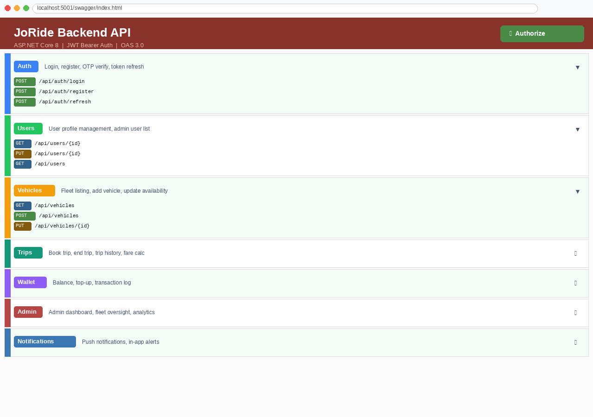

# JoRide Backend

[](https://dotnet.microsoft.com/)
[](https://firebase.google.com/)
[](https://jwt.io/)
[](https://swagger.io/)

REST API powering the **JoRide** car-rental / ride-sharing platform for Jordan. Handles user accounts, JWT authentication, vehicle fleet management, trip lifecycle (book → drive → return), in-app wallet payments, OTP verification, digital car keys, push notifications, real-time GPS tracking via Traccar, and an admin dashboard.

> **Related:** [joride-frontend](https://github.com/abdalkarimkehail-oss/joride-frontend) — Flutter mobile app

## Screenshots

| Swagger UI | Endpoint Overview |
|---|---|
|  | See full API docs by running the project and visiting `/swagger` |

> Run locally and navigate to `https://localhost:{PORT}/swagger` to explore all endpoints interactively.

## Tech Stack

| Layer | Technology |
|---|---|
| Framework | ASP.NET Core 8 |
| Language | C# |
| Database | Firebase Firestore (Admin SDK) |
| Auth | JWT Bearer |
| GPS Tracking | Traccar REST API |
| Notifications | Push + SMS/Email services |
| Docs | Swagger / OpenAPI |

## Key Features

- **JWT Auth** — register, login, OTP verification, token refresh
- **Vehicle Fleet** — CRUD, availability tracking, GPS position from Traccar
- **Trip Lifecycle** — book → start → active (live fare meter) → return
- **Digital Keys** — time-limited unlock tokens issued on trip start
- **Wallet Payments** — balance management, charge, top-up, transaction history
- **Admin Dashboard** — user management, fleet oversight, trip monitoring
- **Real-time GPS** — vehicle location polled from Traccar server

## Project Structure

```
JoRideBackend/
├── Controllers/          # REST endpoints (Auth, Users, Vehicles, Trips, Wallet, Admin …)
├── Models/               # Domain entities (User, Vehicle, Trip, Wallet …)
├── Services/             # FirestoreService, JwtTokenService, TraccarService, OtpService …
├── DTOs/                 # Request / response objects
├── Program.cs            # DI container + JWT middleware config
└── appsettings.json      # Configuration (JWT, Firebase, Traccar)
```

## Getting Started

### Prerequisites
- .NET 8 SDK
- Firebase project with Firestore enabled
- `firebase-adminsdk.json` service account key

### Setup

```bash
git clone https://github.com/abdalkarimkehail-oss/joride-backend.git
cd joride-backend

# Place your Firebase service account key
cp /path/to/firebase-adminsdk.json JoRideBackend/

# Update appsettings.json with your JWT secret, Firebase project ID, Traccar URL
dotnet restore
dotnet run
```

API is available at `https://localhost:{PORT}` — Swagger UI at `/swagger`.

## License

[MIT](LICENSE)
